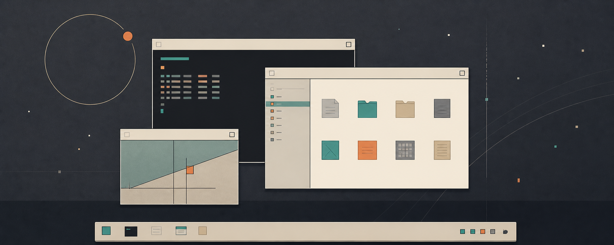

# TaijiOS

TaijiOS is Kryon Labs' flagship operating system: a bootable desktop OS
tree based on the 9legacy branch of Plan 9 from Bell Labs, with Kryon
applications preinstalled as the default working environment.

The tree includes Shelf, Rill, ktrem, Inner Breeze, Pass, and the
supporting Kryon runtime work needed to boot them together inside
TaijiOS. See [README](README) for the historical upstream README file.

## Bundled Kryon Desktop

TaijiOS is the integration target for the Kryon application stack:

- Shelf provides the file manager and desktop file surfaces.
- Rill provides the graphical shell and application launcher.
- ktrem provides the terminal experience.
- Inner Breeze provides breathing, meditation, and habit tracking.
- Pass provides stateless password generation.
- Kryon provides the shared UI/runtime layer used by the applications.

The default QEMU profile boots into this desktop stack, while the text
profile stays available for low-level OS work.

## Boot Locally

To boot TaijiOS, install qemu, so that you have `qemu-system-x86_64` in your path.
Then:

	git clone https://github.com/kryonlabs/taiji.git
	./taiji/boot/qemu

The qemu script builds u9fs in taiji/sys/src/cmd/unix/u9fs and then runs
qemu with the right options to boot diskless, using the git clone as the
root file system.

Because the VM shares the files with your host machine, you can edit files in one place
and see the changes instantly in the other place. For example, you can edit files in your
local editor even if you are running tests in the TaijiOS VM.
You can run builds of Go binaries targeting TaijiOS on your host machine
and then test the binaries in the VM.
And you can run more than one VM, all sharing the same file system.

At boot time, the startup disk boot/pxeboot.raw loads a minimal TaijiOS kernel
into memory, which then PXE loads a plan9.ini and new kernel over TFTP (provided by qemu).
So if you make changes to the kernel, you can boot from `ether0!/sys/src/9/pc/9pc`
to test an as-yet-uninstalled kernel.

The plan9.ini is loaded from [/cfg/pxe/525400123456](cfg/pxe/525400123456).
(That number is the VM's MAC address.)
Changes made to that file will be visible on the next VM boot.
